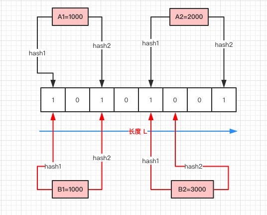

# Bloom filter
问题起源：如何在亿级别数据中快速判断是否存在一个数？

## HashSet 的弊端
设定VM options:
```java
-Xms64m -Xmx64m -XX:+PrintHeapAtGC -XX:+HeapDumpOnOutOfMemoryError
```
```java
public class HashSetTest {
    public static void main(String[] args) {
        long             start = System.currentTimeMillis();
        final int        COUNT = 10000000;
        HashSet<Integer> set   = new HashSet<>(COUNT);
        for (int i = 0; i < COUNT; i++) {
            set.add(i);
        }
        assert set.contains(5678);
        long end = System.currentTimeMillis();
        System.out.println("Time cost(ms): " + (end - start));
    }
}

// java.lang.OutOfMemoryError: Java heap space
// Dumping heap to java_pid17276.hprof ...
// Heap dump file created [1713324 bytes in 0.007 secs]
// Exception in thread "main" java.lang.OutOfMemoryError: Java heap space
```
问题在于，限制VM后，无法将全部数据load到内存中。于是这行`set.add(i)`发生OOM。

## Bloom filter 的诞生
用于判断一个元素是否在一个集合中，只需要很小的内存空间以及有着高效的查询效率。

### 原理描述


> [图片来源](https://github.com/crossoverJie/JCSprout/blob/master/docs/algorithm/guava-bloom-filter.md)

- 初始化一个二进制的数组，长度设为 L（图中为 8），初始值全为 0 。
- 当写入一个 A1=1000 的数据时，需要进行 H 次 hash 函数的运算（这里为 2 次）；
与 HashMap 有点类似，通过算出的 HashCode 与 L 取模后定位到 0、2 处，将该处的值设为 1。
- A2=2000 也是同理计算后将 4、7 位置设为 1。
- 当有一个 B1=1000 需要判断是否存在时，做两次 Hash 运算，定位到 0、2 处，此时他们的值都为 1 ，认为 B1=1000 存在于集合中。
- 当有一个 B2=3000 时。第一次 Hash 定位到 index=4 时，数组中的值为 1，再进行第二次 Hash 运算，定位到 index=5 的值为 0，
认为 B2=3000 不存在于集合中。

简要描述：
- 写入数据时做 H 次 hash 运算定位到数组中的位置，同时将数据改为 1 。
- 数据查询时，以同样方式定位到数组中。一旦其中的有一位为 0，认为数据肯定不存在于集合，否则数据可能存在于集合中。

### 特点
1. 只要返回数据不存在，则肯定不存在。
2. 返回数据存在，则大概率存在。
3. 不能清除其中的数据。

- 第2点解释：Hash 算法可能有冲突，有可能两个完全不同的 A、B 数据最后定位到的位置一样。这就是大概率存在。
- 第3点解释：如果A，B定位相同，这时如果把 B 的数据删除，相当于把 A 的数据删掉，也会造成误报。
- 误报率和 Hash 算法的次数 H，以及数组长度 L 有关。

### 自定义实现
参考 [BloomFilters](..\ssrc\main\java\io\github\wdpm\algorithms\BloomFilters.java)

#### 性能
```bash
...
Heap after GC invocations=19 (full 12):
 PSYoungGen      total 20480K, used 0K [0x00000000feb00000, 0x0000000100000000, 0x0000000100000000)
  eden space 19456K, 0% used [0x00000000feb00000,0x00000000feb00000,0x00000000ffe00000)
  from space 1024K, 0% used [0x00000000ffe00000,0x00000000ffe00000,0x00000000fff00000)
  to   space 1024K, 0% used [0x00000000fff00000,0x00000000fff00000,0x0000000100000000)
 ParOldGen       total 44032K, used 39686K [0x00000000fc000000, 0x00000000feb00000, 0x00000000feb00000)
  object space 44032K, 90% used [0x00000000fc000000,0x00000000fe6c1b60,0x00000000feb00000)
 Metaspace       used 3226K, capacity 4564K, committed 4864K, reserved 1056768K
  class space    used 349K, capacity 388K, committed 512K, reserved 1048576K
}
Time cost(ms): 745
```
`ParOldGen => object space 44032K, 90%`，12次全GC，老年代90%，占用率很高。累计用时745ms。

#### 误判
```java
final int    COUNT        = 1000000;//从1000w改为100W会误判4亿
BloomFilters bloomFilters = new BloomFilters(COUNT);
for (int i = 0; i < COUNT; i++) {
    bloomFilters.add(i + "");
}
Assertions.assertFalse(bloomFilters.mightContain(400230340 + ""));
```
将Bloom数组长度从1000W改为100w，对于这个数`400230340`(4亿量级)而言，hash冲突，产生误判。

### guava 实现
```java
long start = System.currentTimeMillis();
com.google.common.hash.BloomFilter<Integer> filter = BloomFilter.create(
        Funnels.integerFunnel(),
        10000000,
        0.01);

for (int i = 0; i < 10000000; i++) {
    filter.put(i);
}

Assertions.assertFalse(filter.mightContain(400230340));
long end = System.currentTimeMillis();
System.out.println("Time use(ms)：" + (end - start));
```
#### 性能
```
Heap after GC invocations=91 (full 0):
 PSYoungGen      total 20992K, used 32K [0x00000000feb00000, 0x0000000100000000, 0x0000000100000000)
  eden space 20480K, 0% used [0x00000000feb00000,0x00000000feb00000,0x00000000fff00000)
  from space 512K, 6% used [0x00000000fff00000,0x00000000fff08000,0x00000000fff80000)
  to   space 512K, 0% used [0x00000000fff80000,0x00000000fff80000,0x0000000100000000)
 ParOldGen       total 44032K, used 12897K [0x00000000fc000000, 0x00000000feb00000, 0x00000000feb00000)
  object space 44032K, 29% used [0x00000000fc000000,0x00000000fcc98740,0x00000000feb00000)
 Metaspace       used 4121K, capacity 4832K, committed 5120K, reserved 1056768K
  class space    used 450K, capacity 464K, committed 512K, reserved 1048576K
}
Time use(ms)：4966
```
`object space 44032K, 29%`老年代占用率29%，全GC次数为0。累计用时4.9s。

#### 源码分析
TODO

### 小结
Bloom filter本质思想是：通过多次hash，映射到bit，来判断某个数是否存在，避免直接查询元素值的做法。